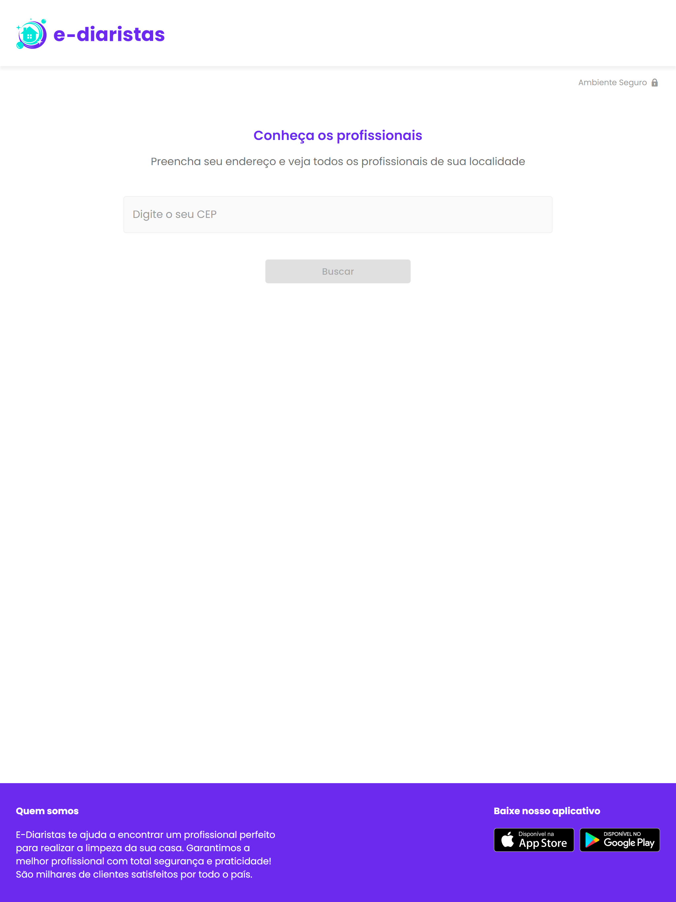
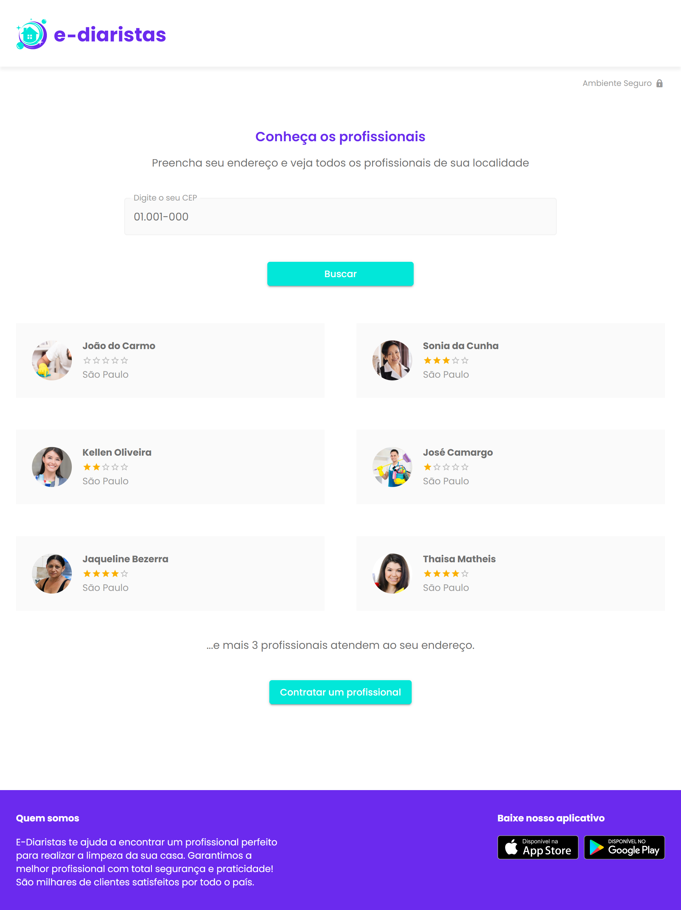

# Semana Multi Stack 

A semana de treinamento Multi Stack pelo TreinaWeb, foi desenvolvido um projeto do zero em desenvolvimento Web e Mobile utilizando a mesma interface atraves de uma `API`.
- Desenvolvimento Front-End: `React e Next.JS`.

     - Html
     - CSS
     - React
     - TypeScript


## Checklist do Ambiente

- [x]  Instalar Node.js
    - 📥 [Download](https://nodejs.org/en/)
    - 🔗 [Guia de Instalação](https://www.treinaweb.com.br/blog/instalacao-do-node-js-windows-mac-e-linux/)
- [x]  Instalar VS Code
    - 📥 [Download](https://code.visualstudio.com/)
    - 🔗 [Guia de Instalação](https://www.treinaweb.com.br/blog/instalacao-do-vs-code-no-windows-linux-e-macos/)
- [x]  Instalar extensão Styled Components
- [x]  executar projeto


## Iniciando Projeto
 ```jsx
npm run dev
    ou
yarn dev
```
 - Porta que sera usada
    -  `[http://localhost:3000]` 


### Ediaristas Web - Pagina de busca


### Ediaristas Web - Pagina com resultados encontrados





   